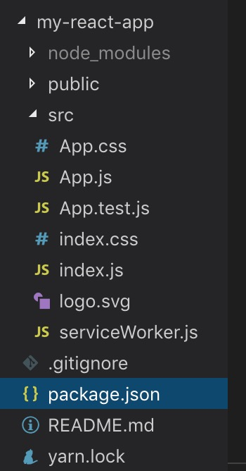

React 入门学习

一. 学习前的准备
React, React Router, mobx, rudux

1. 简介

> React 的核心思想是：封装组件

2. webpack 构建项目
   react 脚手架：[create-react-app](https://github.com/facebook/create-react-app)

> npx create-react-app my-react-app
> cd my-app
> npm start



3. JSX 语法

##### 使用 JSX

利用 JSX 编写 DOM 结构，可以用原生的 HTML 标签，也可以直接像普通标签一样引用 React 组件。这两者约定通过大小写来区分，*小写*的字符串是 HTML 标签，*大写*开头的变量是 React 组件。
style 属性接受由 CSS 属性构成的 JS 对象
注意：
class -> className
for -> htmlFor

```jsx
var myDivElement = <div className="foo" />
var myLabelElement = <label htmlFor="name" />
```

##### 属性可以扩散

使用...扩散属性，属性也可以被覆盖

```
var props = { foo: 'default' };
var component = <Component {...props} foo={'override'} />;
console.log(component.props.foo); // 'override'
```

##### 使用 javascript 表达式:

属性值使用{}包裹，替换""

```jsx
var person = <Person title="人员" isShow={true} name={window.isLoggedIn ? window.name : ''} />

var content = <Container>{window.isLoggedIn ? <Nav /> : <Login />}</Container>
```

```jsx
const data = [11, 22, 33]
var content = (
  <Nav>
    {}
    <Person name={window.isLoggedIn ? window.name : ''} />
  </Nav>
)
```

##### 注释

在 JSX 里使用注释也很简单，就是沿用 JavaScript，唯一要注意的是在一个组件的子元素位置使用注释要用 {} 包起来

```jsx
var content = (
  <Nav>
    {/* child comment, put {} around */}
    <Person
      /* multi
           line
           comment */
      name={window.isLoggedIn ? window.name : ''} // end of line comment
    />
  </Nav>
)
```

##### HTML 转义

React 会将所有要显示到 DOM 的字符串转义，防止 XSS。所以如果 JSX 中含有转义后的实体字符比如 &copy; (©) 最后显示到 DOM 中不会正确显示，因为 React 自动把 &copy; 中的特殊字符转义了。有几种解决办法：
直接使用 UTF-8 字符 ©
使用对应字符的 Unicode 编码，查询编码
使用数组组装 `<div>{['cc ', <span>&copy;</span>, ' 2015']}</div>`
直接插入原始的 HTML

```jsx
<div dangerouslySetInnerHTML={{ __html: 'cc &copy; 2015' }} />
```

##### 自定义 HTML 属性

如果在 JSX 中使用的属性不存在于 HTML 的规范中，这个属性会被忽略。如果要使用自定义属性，可以用 data- 前缀。
可访问性属性的前缀 aria- 也是支持的。

4. 组件
   4.1. 生命周期

   4.2. 事件处理

   4.3. dom 操作

   4.4. 组件间通信

react dva 的 connect 与 @connect
https://dvajs.com/guide/introduce-class.html#connect-方法

connect 的作用是将组件和 models 结合在一起。将 models 中的 state 绑定到组件的 props 中。并提供一些额外的功能，譬如 dispatch

connect 的使用

【connect 方法返回的也是一个 React 组件，通常称为容器组件。因为它是原始 UI 组件的容器，即在外面包了一层 State。

connect 方法传入的第一个参数是 mapStateToProps 函数，该函数需要返回一个对象，用于建立 State 到 Props 的映射关系。】

简而言之，connect 接收一个函数，返回一个函数。

第一个函数会注入全部的 models，你需要返回一个新的对象，挑选该组件所需要的 models。

```js
export default connect(({ user, login, global = {}, loading }) => ({
currentUser: user.currentUser,
collapsed: global.collapsed,
fetchingNotices: loading.effects['global/fetchNotices'],
notices: global.notices
}))(BasicLayout);

// 简化版
export default connect(
({ user, login, global = {}, loading }) => {
return {
currentUser: user.currentUser,
collapsed: global.collapsed,
fetchingNotices: loading.effects['global/fetchNotices'],
notices: global.notices
}
}
)(BasicLayout);
复制代码

@connect 的使用

其实只是 connect 的装饰器、语法糖罢了。

复制代码
// 将 model 和 component 串联起来
export default connect(({ user, login, global = {}, loading }) => ({
currentUser: user.currentUser,
collapsed: global.collapsed,
fetchingNotices: loading.effects['global/fetchNotices'],
notices: global.notices,
menuData: login.menuData, // by hzy
redirectData: login.redirectData, // by hzy
}))(BasicLayout);

// 改为这样（export 的不再是 connect，而是 class 组件本身。），也是可以执行的，但要注意@connect 必须放在 export default class 前面：
// 将 model 和 component 串联起来
@connect(({ user, login, global = {}, loading }) => ({
currentUser: user.currentUser,
collapsed: global.collapsed,
fetchingNotices: loading.effects['global/fetchNotices'],
notices: global.notices,
menuData: login.menuData, // by hzy
redirectData: login.redirectData, // by hzy
}))

export default class BasicLayout extends React.PureComponent {
// ...
}
```
